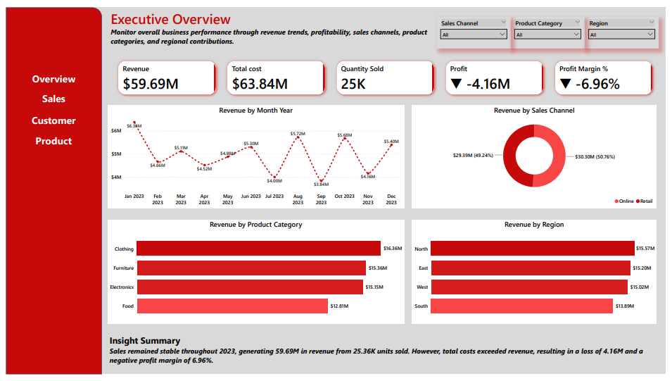
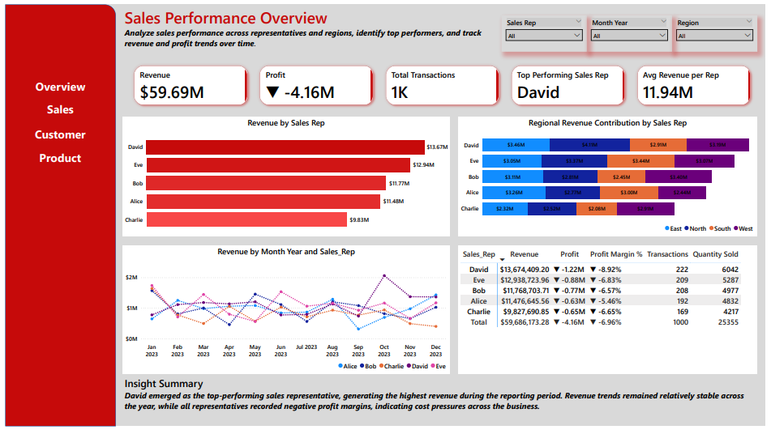
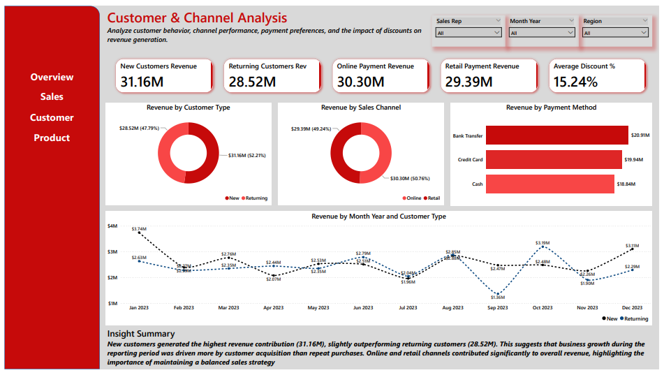
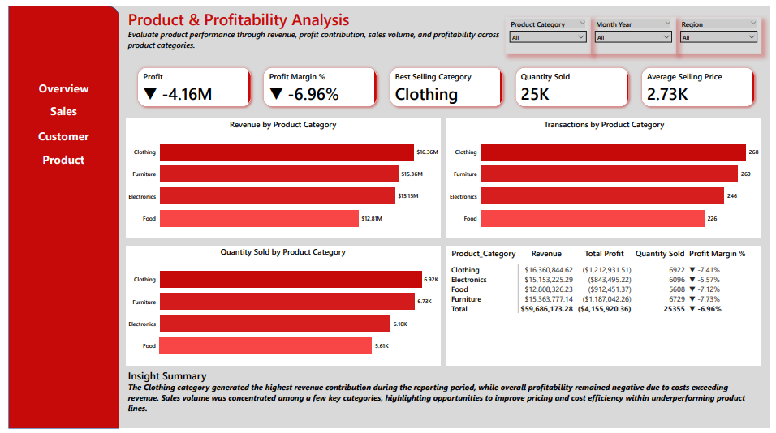

# Sales Performance & Profitability Analysis Dashboard

## Table of Contents

- [Project Overview](#project-overview)
- [Business Problem](#business-problem)
- [Project Objectives](#project-objectives)
- [Dataset Overview](#dataset-overview)
- [Tools & Technologies Used](#tools--technologies-used)
- [Data Preparation](#data-preparation)
- [Dashboard Pages](#dashboard-pages)
  - [1. Executive Overview](#1-executive-overview)
  - [2. Sales Performance Dashboard](#2-sales-performance-dashboard)
  - [3. Customer & Channel Analysis](#3-customer--channel-analysis)
  - [4. Product & Profitability Analysis](#4-product--profitability-analysis)
- [Key Business Insights](#key-business-insights)
- [Recommendations](#recommendations)
- [Conclusion](#conclusion)

---

# Project Overview

In this project, I developed an interactive Power BI dashboard to analyze sales performance, customer behavior, sales channel effectiveness, and product profitability. The objective was to transform raw transactional sales data into meaningful business insights that support data-driven decision-making.

Using Power BI, Power Query, and DAX, I built a multi-page dashboard that enables stakeholders to monitor key performance indicators, evaluate sales performance, understand customer purchasing patterns, and identify opportunities to improve profitability.

---

# Business Problem

Although the business generated substantial revenue during the reporting period, profitability remained a challenge. Stakeholders needed better visibility into sales performance, customer behavior, sales channels, and product performance to understand what was driving business results.

To address this challenge, I created a comprehensive analytical dashboard that provides a clear view of business performance and highlights areas requiring strategic attention.

---

# Project Objectives

The objectives of this project were to:

- Analyze overall business performance and profitability.
- Evaluate sales representative performance.
- Identify key revenue drivers across regions and product categories.
- Compare revenue generated by new and returning customers.
- Assess sales channel effectiveness.
- Analyze the impact of discounts on revenue generation.
- Evaluate product category performance and profitability.
- Provide actionable business recommendations based on data insights.

---

# Dataset Overview

The dataset contains sales transaction records with information such as:

| Column | Description |
|----------|-------------|
| Sale Date | Date of transaction |
| Product Category | Product classification |
| Product Name | Product sold |
| Sales Amount | Revenue generated |
| Cost Amount | Cost incurred |
| Quantity | Number of units sold |
| Unit Price | Selling price per unit |
| Discount | Discount applied |
| Sales Rep | Sales representative |
| Customer Type | New or Returning customer |
| Sales Channel | Online or Retail |
| Payment Method | Customer payment method |
| Region | Sales region |

---

# Tools & Technologies Used

- Power BI
- Power Query
- DAX
- Data Visualization
- Data Cleaning & Transformation

---

# Data Preparation

Before building the dashboard, I performed several data preparation steps to ensure the dataset was ready for analysis:

- Reviewed the dataset for consistency and completeness.
- Converted date fields into appropriate date formats.
- Created Month-Year fields for trend analysis.
- Created Discount Band categories for discount analysis.
- Developed calculated measures to support KPI reporting.
- Applied formatting and optimization techniques to improve dashboard usability.

---

# Dashboard Pages

# 1. Executive Overview

### Dashboard Preview

### Overview

The Executive Overview page provides a high-level summary of overall business performance. I used KPI cards and visualizations to monitor revenue, costs, profitability, sales volume, and revenue trends across regions, product categories, and sales channels.

### KPIs

- Revenue
- Total Cost
- Quantity Sold
- Profit 
- Profit Margin %

### Visuals

- Monthly Revenue Trend
- Revenue by Region
- Revenue by Product Category
- Revenue by Sales Channel

### Purpose

I designed this page to provide stakeholders with a quick understanding of the company's overall performance and financial health.

---

# 2. Sales Performance Dashboard

### Dashboard Preview

### Overview

In this page, I analyzed the performance of individual sales representatives and their contribution to revenue generation. The dashboard helps identify top performers, compare regional contributions, and evaluate sales trends over time.

### KPIs

- Total Revenue
- Total Profit
- Total Transactions
- Top Performing Sales Representative
- Average Revenue per Sales Representative

### Visuals

- Revenue by Sales Representative
- Revenue Trend by Sales Representative
- Revenue by Region and Sales Representative
- Sales Representative Performance Matrix

### Purpose

I created this page to help management evaluate sales team performance and identify opportunities for improvement.

---

# 3. Customer & Channel Analysis

### Dashboard Preview

### Overview

On this page, I explored customer purchasing behavior and sales channel performance. The analysis focuses on understanding how different customer groups and channels contribute to overall revenue generation.

### KPIs

- Revenue from New Customers
- Revenue from Returning Customers
- Online Sales Revenue
- Retail Sales Revenue
- Average Discount %

### Visuals

- Revenue by Customer Type
- Revenue by Sales Channel
- Revenue by Payment Method
- Discount Impact on Revenue
- Customer Type Revenue Trend

### Purpose

I used this page to identify customer acquisition trends, retention performance, and the effectiveness of different sales channels.

---

# 4. Product & Profitability Analysis

### Dashboard Preview

### Overview

This page focuses on evaluating product performance and profitability. I analyzed which product categories generated the most revenue, sold the highest quantity, and contributed the most to overall profitability.

### KPIs

- Total Profit
- Profit Margin %
- Best Selling Category
- Total Quantity Sold
- Average Selling Price

### Visuals

- Revenue by Product Category
- Profit by Product Category
- Quantity Sold by Category
- Profit Margin by Category
- Top Products Table

### Purpose

I developed this page to identify high-performing products and uncover profitability challenges across product categories.

---

# Key Business Insights

### Revenue Performance

The business generated approximately **59.69M** in revenue from over **25K units sold**, demonstrating strong sales activity throughout the reporting period.

### Profitability Challenge

Despite strong revenue generation, the business recorded a loss of approximately **4.16M**, resulting in a negative profit margin of **6.96%**. This indicates that costs consistently exceeded revenue and highlights a profitability issue rather than a sales issue.

### Customer Analysis

New customers generated approximately **31.16M** in revenue, outperforming returning customers who generated **28.52M**. This suggests that business growth was largely driven by customer acquisition efforts.

### Sales Performance

Revenue contribution varied among sales representatives, with a small number of representatives generating a significant portion of total sales revenue.

### Channel Performance

Online and Retail channels contributed relatively similar levels of revenue, demonstrating balanced channel performance and reducing dependence on a single sales channel.

### Product Performance

Product categories contributed differently to revenue, sales volume, and profitability, revealing opportunities to optimize product strategies and pricing decisions.

---

# Recommendations

Based on my analysis, I recommend the following:

### Improve Cost Management

Review operational and product-related costs to identify inefficiencies that are negatively impacting profitability.

### Reassess Discount Strategies

Evaluate discount policies to ensure discounts drive sustainable revenue growth without significantly reducing profit margins.

### Strengthen Customer Retention

Implement customer retention initiatives to increase repeat purchases and improve customer lifetime value.

### Focus on High-Performing Products

Invest more resources in top-performing product categories while reassessing the performance of underperforming products.

### Replicate Top Sales Practices

Analyze the strategies used by top-performing sales representatives and apply successful practices across the sales team.

---

# Conclusion

Through this analysis, I discovered that the business demonstrates strong revenue generation capabilities but struggles with profitability. Despite generating approximately **59.69M** in revenue, total costs exceeded revenue, resulting in a loss of approximately **4.16M** and a negative profit margin of **6.96%**.

The findings suggest that the business does not have a sales problem but rather a profitability problem. By improving cost efficiency, refining discount strategies, strengthening customer retention efforts, and focusing on profitable products, the organization can move toward sustainable growth and improved financial performance.

---

## Author

**Tijani Olawale**

Aspiring Data Analyst skilled in SQL, Excel, Power Query, Power BI, and Data Visualization.

### Connect With Me

- LinkedIn: *(Add your LinkedIn profile link)*
- GitHub: *(Add your GitHub profile link)*
